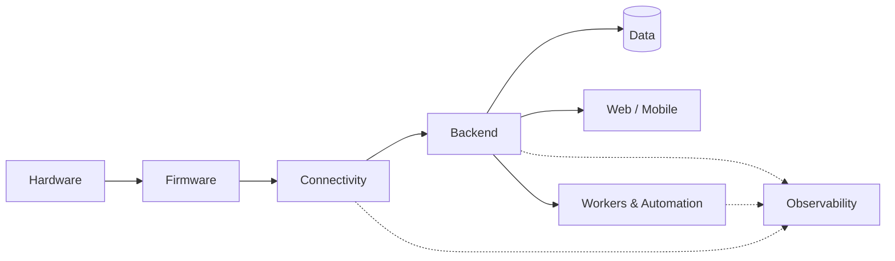
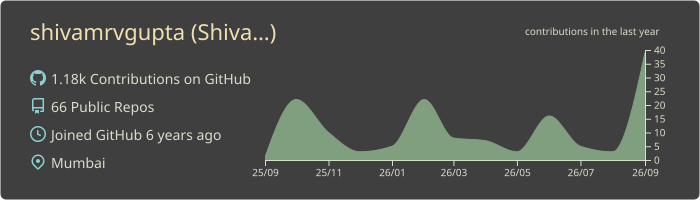
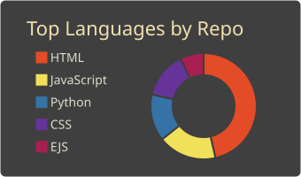
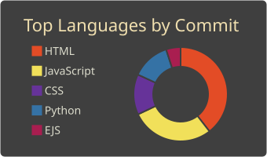
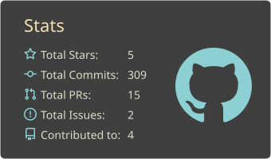
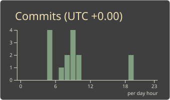

<h1 align="center">Shivam Gupta</h1>

<p align="center">
  <b>Engineer · Team Lead</b><br/>
  Building products across hardware, embedded systems, cloud and software.
</p>

<p align="center">
  <a href="https://www.shivam-gupta.tech/">
    
  </a>
  <a href="https://www.linkedin.com/in/shivamrvgupta/">
    
  </a>
  <a href="https://twitter.com/shivamrvgupta04">
    
  </a>
  <a href="mailto:shivamrvgupta@gmail.com">
    
  </a>
</p>

<p align="center">
  
</p>

---

### `whoami`

I build products end to end — from hardware and firmware to APIs, infrastructure and the applications that sit on top.

My work sits at the intersection of **product engineering, embedded systems, cloud architecture and automation**.

I enjoy working across layers because many of the hardest engineering problems exist between them.

```ts
const shivam = {
  role: "Engineer · Team Lead",

  builds: [
    "embedded systems",
    "backend platforms",
    "web & mobile products",
    "automation"
  ],

  focus: [
    "system architecture",
    "reliability",
    "developer velocity",
    "product engineering"
  ],

  currentlyThinkingAbout: [
    "AI in production",
    "IoT platforms",
    "event-driven systems",
    "cost-aware infrastructure"
  ]
};
````

---

### What I Build

I work across the complete product stack.

**Hardware**

* PCB and electronics design
* Sensors and connected devices
* Device communication and telemetry

**Embedded**

* C / C++
* ESP32
* RTOS
* BLE, Wi-Fi and MQTT

**Backend**

* APIs and services
* Real-time systems
* Queues and background workers
* Integrations and automation

**Product**

* Web applications
* Mobile applications
* Operational dashboards
* Internal platforms

**Infrastructure**

* Cloud deployments
* Containers
* CI/CD
* Monitoring and observability

---

### Architecture



The goal is not to introduce complexity for its own sake.

I prefer systems that are **observable, maintainable and easy to change** as the product evolves.

---

### Selected Work

A few areas I have worked across:

* **Connected hardware** — building software around physical devices, sensors and telemetry.
* **Operational platforms** — systems connecting field operations, internal teams and business workflows.
* **Communication systems** — messaging, notifications and automation integrated into production workflows.
* **AI systems** — voice and LLM-based systems integrated into real product workflows.
* **Developer infrastructure** — deployment pipelines, services, monitoring and tooling that keep products moving.

---

### Stack

**Languages**


**Backend**


**Frontend & Mobile**


**Data & Messaging**


**Infrastructure**


**Hardware**


---

### How I Build

* **Understand the physical constraints first.** Software cannot fix a hardware decision after deployment.
* **Prefer boring technology.** Introduce complexity only when it solves a real problem.
* **Measure production systems.** Observability is part of the system, not an afterthought.
* **Make reversible decisions quickly.** Slow down when a decision is expensive to undo.
* **Ship incrementally.** Small changes are easier to understand, test and recover.
* **Own the result.** Writing the code is only one part of shipping a product.

---

### GitHub

Most of my work happens in private repositories and production systems, so the public profile is only a small part of what I build.

<p align="center">
  
</p>

<p align="center">
  
  
</p>

<p align="center">
  
  
</p>

---

<p align="center">
  <i>Building across the hardware–software boundary.</i>
  <br/>
  <!-- <a href="https://www.shivam-gupta.tech/">shivam-gupta.tech</a> -->
</p>
